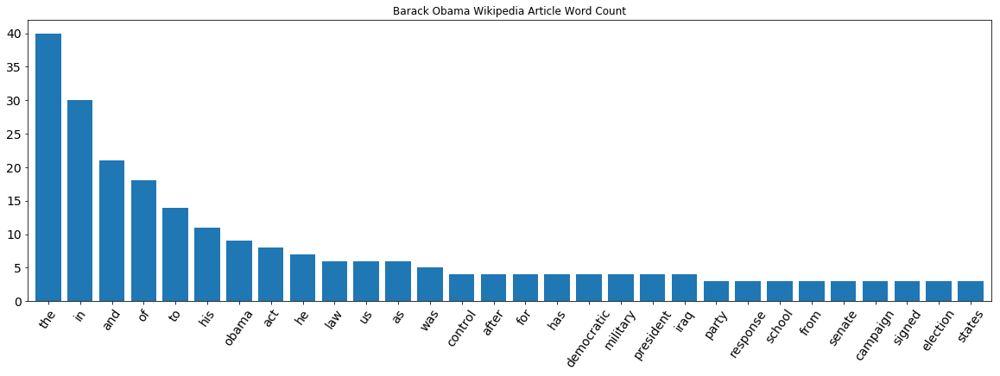
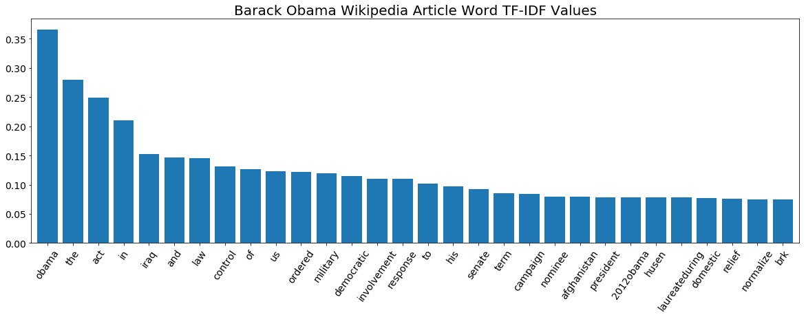

```python
from sklearn.feature_extraction.text import TfidfVectorizer, CountVectorizer
from sklearn.neighbors import NearestNeighbors
import pandas as pd
import numpy as np
%matplotlib inline
```


```python
wiki_data = pd.read_csv('wiki_people.csv', index_col = 'name')['text']
wiki_data.shape

```


    (53164,)


```python
wiki_data.head()
```


    name
    Mark Spencer (politician)    mark steven spencer born 20 january 1970is an ...
    Madison U. Sowell            madison u sowell is the provost at southern vi...
    Harry B. Luthi               harry b luthi sr born 1933 is a retired busine...
    Abou Diaby                   vassiriki abou diaby french pronunciation abu ...
    Roger Sedarat                roger sedarat is an iranianamerican poet he is...
    Name: text, dtype: object


```python
#One way to represent a text document is to count the instance of 
#every word in the document. Then articles can be compared based on
#how similar their word count vectors are.
```


```python
name = 'Barack Obama'
text = wiki_data[name]
count_vectorizer = CountVectorizer()
count_matrix = count_vectorizer.fit_transform([text])
features = count_vectorizer.get_feature_names()
data = pd.Series(count_matrix.toarray().flatten(), index = features).sort_values(ascending=False)
ax = data[:30].plot(kind='bar',figsize=(20,6),width=.8, fontsize=14,rot=55,title='Barack Obama Wikipedia Article Word Count')
```





```python
#Term frequency-inverse document fequency is a statistic that reflects
#how importnat a word is to a specific document relative to all of the
#words in a collection of documents(the corpus). The tf-idf value increases
#proportionally to the number of times that word appears in the document,
#but is offset by the frequency of the word in the corpus.
```


```python
tfidf_vectorizer = TfidfVectorizer()
tfidf_matrix = tfidf_vectorizer.fit_transform(wiki_data)
features = tfidf_vectorizer.get_feature_names()
row = wiki_data.index.get_loc(name)
data = pd.Series(tfidf_matrix.getrow(row).toarray().flatten(), index = features).sort_values(ascending=False)
ax = data[:30].plot(kind='bar', title='Barack Obama Wikipedia Article Word TF-IDF Values', figsize=(20,6), width = .8, fontsize=14,rot=55)
ax.title.set_size(20)
```





```python
knn = NearestNeighbors(n_neighbors=10).fit(tfidf_matrix)
```


```python
def get_closest_neighbours(name):
    row = wiki_data.index.get_loc(name)
    distances, indices = knn.kneighbors(tfidf_matrix.getrow(row))
    names_similar = pd.Series(indices.flatten()).map(wiki_data.reset_index()['name'])
    result = pd.DataFrame({'distance':distances.flatten(), 'name':names_similar})
    return result


```


```python
get_closest_neighbours("Barack Obama")
```


<div>
<style>
    .dataframe thead tr:only-child th {
        text-align: right;
    }

    .dataframe thead th {
        text-align: left;
    }

    .dataframe tbody tr th {
        vertical-align: top;
    }
</style>
<table border="1" class="dataframe">
  <thead>
    <tr style="text-align: right;">
      <th></th>
      <th>distance</th>
      <th>name</th>
    </tr>
  </thead>
  <tbody>
    <tr>
      <th>0</th>
      <td>0.000000</td>
      <td>Barack Obama</td>
    </tr>
    <tr>
      <th>1</th>
      <td>1.067974</td>
      <td>Joe Biden</td>
    </tr>
    <tr>
      <th>2</th>
      <td>1.109491</td>
      <td>Hillary Rodham Clinton</td>
    </tr>
    <tr>
      <th>3</th>
      <td>1.117104</td>
      <td>Samantha Power</td>
    </tr>
    <tr>
      <th>4</th>
      <td>1.139620</td>
      <td>Eric Stern (politician)</td>
    </tr>
    <tr>
      <th>5</th>
      <td>1.147363</td>
      <td>George W. Bush</td>
    </tr>
    <tr>
      <th>6</th>
      <td>1.149957</td>
      <td>John McCain</td>
    </tr>
    <tr>
      <th>7</th>
      <td>1.154632</td>
      <td>Artur Davis</td>
    </tr>
    <tr>
      <th>8</th>
      <td>1.157366</td>
      <td>Henry Waxman</td>
    </tr>
    <tr>
      <th>9</th>
      <td>1.159638</td>
      <td>Jeff Sessions</td>
    </tr>
  </tbody>
</table>
</div>


```python
get_closest_neighbours("Taylor Swift")
```


<div>
<style>
    .dataframe thead tr:only-child th {
        text-align: right;
    }

    .dataframe thead th {
        text-align: left;
    }

    .dataframe tbody tr th {
        vertical-align: top;
    }
</style>
<table border="1" class="dataframe">
  <thead>
    <tr style="text-align: right;">
      <th></th>
      <th>distance</th>
      <th>name</th>
    </tr>
  </thead>
  <tbody>
    <tr>
      <th>0</th>
      <td>0.000000</td>
      <td>Taylor Swift</td>
    </tr>
    <tr>
      <th>1</th>
      <td>1.109846</td>
      <td>Carrie Underwood</td>
    </tr>
    <tr>
      <th>2</th>
      <td>1.129025</td>
      <td>Kelly Clarkson</td>
    </tr>
    <tr>
      <th>3</th>
      <td>1.138605</td>
      <td>Dolly Parton</td>
    </tr>
    <tr>
      <th>4</th>
      <td>1.139351</td>
      <td>Joss Stone</td>
    </tr>
    <tr>
      <th>5</th>
      <td>1.148614</td>
      <td>Ed Sheeran</td>
    </tr>
    <tr>
      <th>6</th>
      <td>1.151302</td>
      <td>Rihanna</td>
    </tr>
    <tr>
      <th>7</th>
      <td>1.153083</td>
      <td>JoJo (singer)</td>
    </tr>
    <tr>
      <th>8</th>
      <td>1.154104</td>
      <td>Miranda Lambert</td>
    </tr>
    <tr>
      <th>9</th>
      <td>1.154456</td>
      <td>Amy Grant</td>
    </tr>
  </tbody>
</table>
</div>


```python

```
